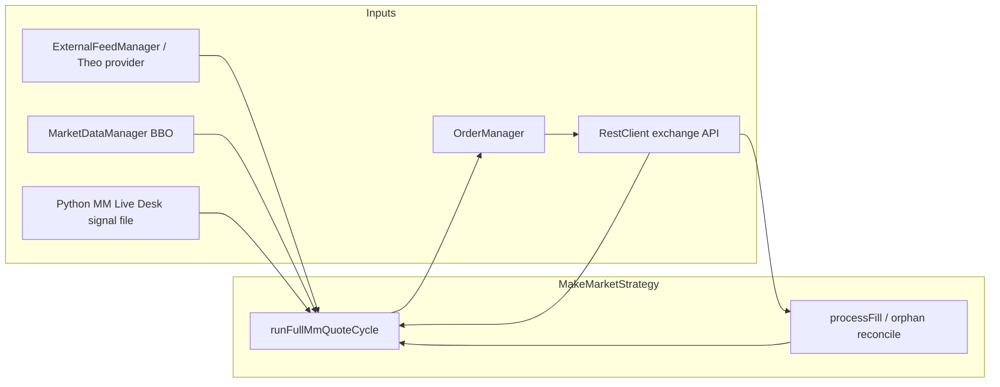
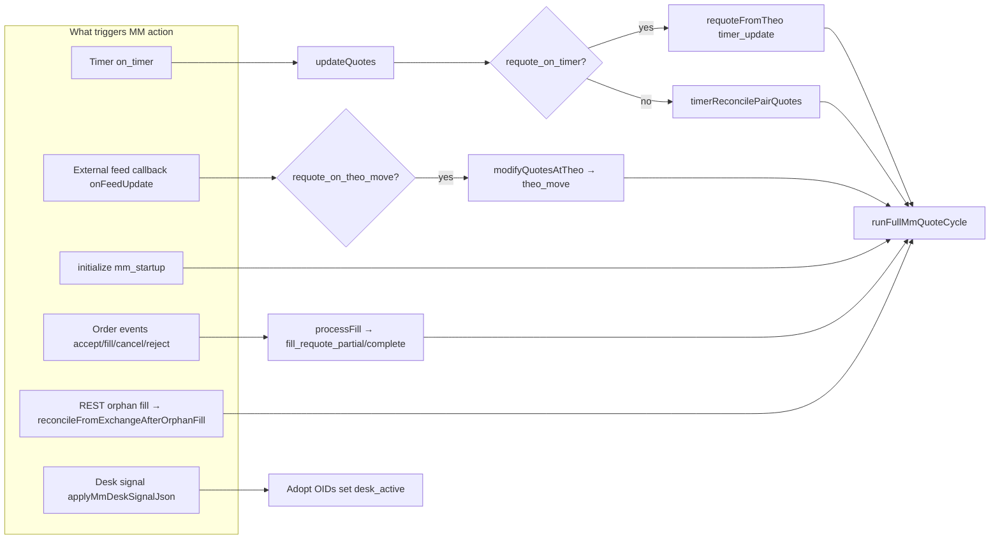
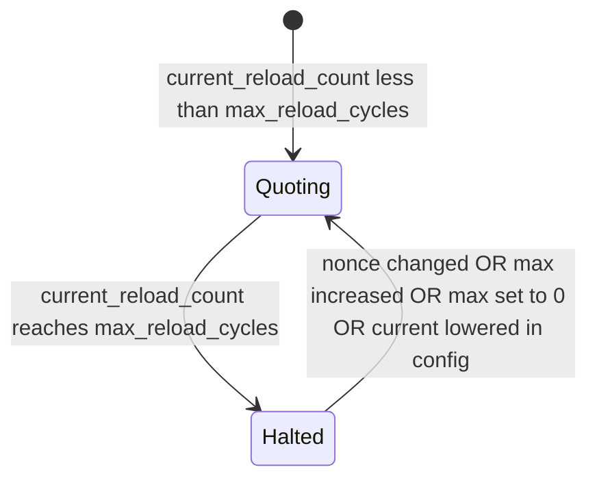
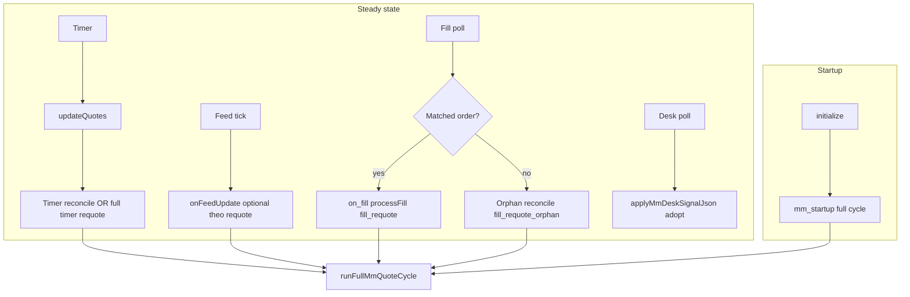

# Make Market Strategy — Technical Specification

This document describes the **`MakeMarketStrategy`** (`make_market`) implementation in **platform_core**: how it prices quotes, when it places or cancels orders, how it interacts with the **MM Live Desk (Python)**, **exchange REST fill polling**, and **safety limits**.

After a soak run, grep the log and print a short verdict with **`scripts/soak_audit.sh`** (see `scripts/README.md`).

---

## 1. Purpose

The strategy maintains up to **two resting limit orders** on the **Architect (AX) quoting instrument** (e.g. `PAIR-PERP` from `market_maker.symbol` or `market_maker.instruments[]`):

- A **bid** and an **ask**, sized per config, spaced around a **theoretical mid** derived from an **external pricing feed** (e.g. Neon FIX, file cache, or REST).
- **Inventory skew** (when **|NetPo| < `max_position`**): `skew_tick_units = floor(net / adjust_position) * adjust_ticks`; `skew_price = skew_tick_units * price_tick` — the **same** skew is subtracted from bid and offer (+net long → both lower; −net short → both higher). **`max_position`** also gates skew (no skew in raw math at or beyond the cap); at the boundary and beyond, **`shouldQuoteSide`** blocks **new** quotes on the **add** side (BUY only while `NetPo < max`; SELL only while `NetPo > -max`), and per-leg size is **headroom-capped** so a full `order_size` cannot push through the cap from below.
- **Non-crossing** checks (optional) ensure quotes do not cross the AX best bid/offer when market data is available.
- On **matched fills**, **`processFill`** drives **cancel-all and re-place**. On **orphan** fills (REST fill with no local order id), the client **syncs inventory** and **replaces** only when **REST NetPo changes**; fill polling uses a **persisted `trade_id` cursor** so restarts do not replay the same historic fill.

---

## 2. Architecture Overview



| Component | Role |
|-----------|------|
| **Theo provider** | Supplies mid (or bid/ask) for `market_maker.theo_symbol`. |
| **Market quote provider** (optional) | AX BBO for validation; else **WS book** via `MarketDataManager`. |
| **OrderManager** | Internal order ids, `exchange_order_id` index, fill injection from REST poll. |
| **RestClient** | `place_order`, `cancel_all`, `getFills`, `getPositions`, order-gateway **GET `/open-orders`** (desk adoption fallback). |
| **Trading loop** (`StartupSequence`) | Timer firing, **fill polling**, **desk signal polling** (if enabled). |

---

## 3. Configuration (market_maker)

Keys live under **`market_maker`** in JSON (see `config/default_config.json` and `Config.cpp` defaults). Highlights:

| Key | Meaning |
|-----|---------|
| `enabled` | Master switch. |
| `symbol` | AX symbol for quoting (e.g. `GBPUSD-PERP`). |
| `order_symbol` | If set, used for **place_order** instead of `symbol`. |
| `quantity` / `order_size` | Per-leg size (contracts); must respect `order_size_step`. |
| `price_tick` | Quote tick on AX. |
| `theo_symbol` | Label for theo lookup (must align with external feed). |
| `basis` | Added to theo mid before half-spread math. |
| `spread_ticks` / `width` / `bid_width` / `ask_width` | **Half-spread** in ticks from theo each side (default: same W bid/ask). Resting pair span = **exactly** `(bid_width + ask_width + extras)` ticks on the grid after rounding (anchored bid, ask derived). |
| `resting_depth_extra_ticks` | C++ only: added to **both** half-spreads (default **0**). **Keep at 0** for client product. Desk ignores this for quote math. |
| `post_fill_extra_ticks` | After a fill, extra ticks on **touched side only** next cycle (default **0**). Non-zero breaks a fixed 2·`width` pair span. |
| `max_position` | **Tim spec (2026-05-26):** Placement uses **net position only** — resting open orders are **not** included in the add-side check (so multiple pairs can quote while \|NetPo\| < max). **On every fill** (partial or full): if **rounded NetPo ≥ +max** → cancel all **BUY**s on the product; if **NetPo ≤ −max** → cancel all **SELL**s. **Fill-instant** over-max is acceptable iff **\|net_after_fill\| ≤ max + sum(qty resting on the filled side immediately before the fill)** (not post-pull steady state — resting has converted to position). Logs: `[MM_CAP] BREACH_ACCEPTABLE` at fill time; `[MM_CAP] REDUCE_ONLY_OVER_CAP` while latched burst unwinds; `[MM_CAP] BREACH_UNEXPECTED` only if fill-instant bound fails with no latch (Joe). At cap: reduce-only (long → offers only; short → bids only). **Book visibility** for *N* pairs: only *N* bids, only *N* offers, or *2N* orders — never lopsided (e.g. 2 offers + 1 bid). **Phase A (2026-05-26):** `mmConvergeProductBookOnAx` holds the per-AX **placement lease**, **GET /open-orders** (venue truth), cancels grow-side OIDs at cap and orphan/excess OIDs below cap, then tracked pull — log tag `[MM_PRODUCT_CONVERGE]`. **Instrument isolation:** every open-orders parse filters rows by `symbol`/`s` (case-insensitive match to the requested AX); foreign rows are dropped (`dropped_foreign_symbol`); rows with **no** symbol are dropped (`dropped_no_symbol`) so mixed gateway books cannot affect the wrong AX. Converge never venue-cancels an OID tracked on another instrument (`venue_skip_cross_ax` + refuse cancel when `owner_ax` ≠ requested AX). Same filter on venue-truth reconcile and desk adoption. Scales to many instruments × many desk stacks per AX (lease serializes placement per AX only). **Triggers:** cap enter/exit, post-fill sync, post-reconcile enforce, **`periodic_at_cap`** (15s while \|net\| ≥ max), **`post_replace_at_cap`** (every 4 full quote cycles while at cap), **`venue_cardinality_at_cap`** (immediate when reduce-side open-orders rows exceed protected OIDs), **`pre_place_at_cap`** (before any reduce-side place while \|net\| ≥ max).
**Fill-requote (desk):** After a full fill, opposite-leg REST cancel is sent first; re-quote runs only on cancel ack via `enqueueFillRequoteOnMover` (not in parallel with `runFullMmQuoteCycle("fill_requote")`). One in-flight fill-requote per AX. Tim reconcile gate (`MM_RECONCILE_GATE`) waits for `/fills` poll after cancel before place. Gateway-seed adopt is deferred during `cycle_in_flight`, fill-requote, or `CANCEL_PENDING`/`PLACE_PENDING` on the stack. **Protected OID tie-break** (one venue row per desk stack/side): keep **tracked exchange OID** if still on venue; else closest price to stack desired working price within half a tick; greedy claim so stacks do not share one OID. Mitigation until Phase B single-writer controller. |
| `exchange_position_reconcile_sec` | Seconds between **REST** position refreshes for MM (default **3.5**). Each pass updates `position_state_` from `PortfolioManager::refresh()` / positions. If rounded NetPo **>** `max_position` (long) or **< −max_position` (short), **all open orders on the MM AX symbol** for that **adding** side are cancelled via order-gateway `open-orders` + `cancel_order`; **cover-side** orders are left on the book. Local MM ids for the pulled side are cleared. **0** disables this poll. Reconcile runs from `updateQuotes` (timer), so it cannot fire more often than `update_interval_sec` unless that interval is shorter than this value. |
| `adjust_position` | Skew divisor: `skew_tick_units = floor(net/adjust_position) * adjust_ticks` when \|NetPo\| < `max_position`; `skew_price = skew_tick_units * price_tick`. |
| `adjust_ticks` | Multiplier on `floor(net/adjust_position)` for skew tick units (min **1**). |
| `update_interval_sec` | Timer period for `on_timer` → `updateQuotes`. |
| `requote_on_theo_move` | If true, **feed** can trigger full cancel/replace on theo move. |
| `min_theo_move_ticks_to_requote` | **Theo-driven** requote (feed path) only if **resting bid or ask** has \(\lvert p_\text{actual} - p_\text{theo}\rvert \ge\) this many **Architect quote ticks** vs the current MM targets **`new_bid` / `new_ask`** from the latest theo + skew. Minimum **1** at read time (legacy `0` in JSON is clamped to 1). Quote tick is **`GET /markets` → `min_price`** for the MM AX symbol when available, else **`price_tick`**. Default **2**. |
| `requote_on_timer` | If true, timer does full cycle every tick; if false, **timer reconcile** only seeds missing legs. |
| `validate_vs_market` | If true, do not place a side that would cross AX BBO. |
| `cancel_on_disconnect` | If true, cancel MM orders when Architect **WS** disconnected. |
| `cancel_on_external_feed_invalid` | If true, cancel on invalid external quote (e.g. feed errors). |
| `reload_on_fill` | **Legacy / ignored for matched fills:** any exchange fill routed to `processFill` runs a **full cancel + bid+ask** from latest theo + config widths when MM is enabled and theo is available. (Still listed in JSON for older docs.) |
| `current_reload_count` | Integer in **`default_config.json`** (`market_maker`). Compared to **`max_reload_cycles`**. **Only `trading_client` increments** this on MM **exchange accepts** (`on_accept`); MM Live Desk **Apply** does **not** increment it. Operators may set it manually (or via desk Save) to reset or seed. |
| `max_reload_cycles` | When **> 0** and **`current_reload_count` ≥ `max_reload_cycles`**, C++ **halts** new MM placements after one cancel-all (0 = unlimited). |
| `reload_cycles_count_fill_only` | If **true** (default), **`current_reload_count`** increases only on **fill-driven** MM accepts (`fill_requote*`, `mm_bid_reload`, `mm_ask_reload`) — **not** on `theo_move` or `timer_update`. If **false**, counts every MM accept except **theo/timer** (legacy). GUI edits to `current_reload_count` are unchanged. |
| `reload_limit_reset_nonce` | Any **new** value vs last seen clears **`current_reload_count` to 0** in the primary config file and lifts halt. |
| `desk_sync_enabled` | If true, trading loop reloads config and applies **desk signal** JSON. |
| `desk_signal_path` | Path to signal file (default `logs/mm_desk_signal.json`). |
| `orphan_fill_unknown_symbol_reconcile` | When true, orphan fills missing symbol in JSON still run position sync / delta path. |

**`api.fill_poll_cursor_file`** (default `logs/fill_poll_last_trade_id.txt`): persisted max **`trade_id`** from GET **`/fills`** so **process restarts** do not replay the same historic execution as a new orphan. On first poll with an empty cursor, the client **seeds** to the lexicographic max `trade_id` on the returned page and **skips injecting** those rows once. Set to **`""`** to disable persistence (in-memory seed only for that run).

**MM Live Desk save validation** (browser + `persist_desk_config_to_repo`): `width` integer in **[1, 10⁹]**; `order_size`, `max_position`, `adjust_position` each integer **[1, 1,000,000]**; `adjust_ticks` integer **[1, 100]**; `current_reload_count` and `max_reload_cycles` each integer **[0, 1,000,000]**. Non-integers (e.g. decimals) are rejected.

**Hedge** (separate `hedge` section): optional auto-hedge intent (largely **simulated** in current code paths).

### Client-facing width (exchange / desk mandate)

For end users who type a single **width** `W` (with `bid_width` = `ask_width` = `W` and `resting_depth_extra_ticks` = **0**):

- In **raw** space with symmetric `W` and no skew, the per-side offsets are `bid_offset = adjusted_theo · bid_width_bps / 10000` and `ask_offset = adjusted_theo · ask_width_bps / 10000`. Raw bid = adjusted_theo − bid_offset − skew_price; raw ask = adjusted_theo + ask_offset − skew_price. With `bid_w == ask_w == W` the raw pair is `2·W` bps apart before tick rounding (skew is common-mode and cancels in the span). **Tick placement**: bid is **floored** to `price_tick`; ask is **ceilinged** to `price_tick` so the placed span tracks `bid_offset + ask_offset` to within one tick.
- **`resting_depth_extra_ticks`**: keep at **0** in shipped configs. It widens both half-spreads and is not part of the client mental model. **`post_fill_extra_ticks`**: also keep at **0** if you require the same fixed span after fills (non-zero widens only the touched leg and breaks a literal `2W` pair).
- **Inventory skew** applies only when **|NetPo| < `max_position`**: `skew_tick_units = floor(NetPo/adjust_position)*adjust_ticks`; `skew_price = skew_tick_units*price_tick`. Same `skew_price` is subtracted from both raw bid and raw offer (long → both prices lower; short → both higher). At **|NetPo| ≥ `max_position`**, skew is **zero** in raw pricing; **`shouldQuoteSide`** blocks the grow side (reduce-only: long → offers only, short → bids only). Per-leg size stays **`order_size`** (Tim spec: placement gate is **net only**, not net + open orders).
- **MM Live Desk** (Python apply / preview): spread half-widths are **`bid_width` / `ask_width` only**; the desk does **not** add `resting_depth_extra_ticks` to its computed spreads (C++ `trading_client` still reads the full config if operators set extras server-side).

---

## 4. Pricing and Skew (Conceptual)

1. **Theo mid** `T` from external feed (+ optional file cache for desk alignment).
2. **Adjusted theo** = `T + basis`.
3. **Per-side offsets** (bps of mid, desk spec 2026-05-12): both **C++** and the **desk** compute `bid_offset = adjusted_theo · bid_width_bps / 10000` and `ask_offset = adjusted_theo · ask_width_bps / 10000`. Each side gets the full configured bps (NOT half). Total span = `bid_offset + ask_offset` = `adjusted_theo · (bid_w + ask_w) / 10000`.
4. **Skew** (desk + C++): only if **|NetPo| < `max_position`**: `skew_tick_units = floor(net_qty / adjust_position) * adjust_ticks`; `skew_price = skew_tick_units * tick`. Raw bid = `adjusted_theo - bid_offset - skew_price`, raw ask = `adjusted_theo + ask_offset - skew_price` (same `skew_price` subtracted from both legs so it cancels in the span). If **|NetPo| ≥ `max_position`**, `skew_price = 0` here; **add-side** gating is via **`shouldQuoteSide`** plus **headroom qty** / gateway cancels when past the cap.
5. **Round (anchored pair)**: `bid = floor(raw_bid / tick) * tick`, `ask = ceil(raw_ask / tick) * tick`, with `ask >= bid + tick`. Span = `bid_offset + ask_offset` is preserved to within one tick of discretization.
6. **Validate** (if enabled): bid ≤ market ask, ask ≥ market bid, bid < ask.

---

## 5. Canonical Full Cycle: `runFullMmQuoteCycle(theo, reason)`

**Single mutex** `mm_cycle_mutex_` serializes cycles (timer vs fill vs feed).

High-level sequence:

```mermaid
flowchart TD
  A[Enter runFullMmQuoteCycle] --> B{MM enabled?}
  B -->|no| Z[Return]
  B -->|yes| R0[reloadPrimaryConfigFromDisk]
  R0 --> C[syncReloadLimitStateFromConfig]
  C --> F{fill_requote?}
  F -->|yes| F2[Clear mm_desk_active_]
  F -->|no| F2
  F2 --> H{reload limit reached?}
  H -->|yes first time| I[Cancel-all + engage halt]
  H -->|yes later| Z
  H -->|no| J{WS down cancel_on_disconnect?}
  J -->|yes| K[Cancel-all + return]
  J -->|no| S0{NOT fill_requote AND NOT mm_startup AND |net| less than max AND want bid+ask AND active bid+ask in OM?}
  S0 -->|yes| Z
  S0 -->|no| L[Zero pending_accepts_ then cancel strategy]
  L --> L1{|net| less than max OR startup or disconnect or reload halt?}
  L1 -->|yes| L2[Cancel-all + clear local OM]
  L1 -->|no| L3[Cancel add-side gateway orders only + clear that leg's local ids]
  L2 --> M[resetMmSessionFillTracking]
  L3 --> M
  M --> O[Compute bid/ask from theo + skew + extras same formulas]
  O --> P{validate_vs_market?}
  P --> Q[Maybe drop bid and/or ask]
  Q --> R[Submit limits via OrderManager]
  R --> S{Count toward reload limit?}
  S -->|yes + placed| T[mm_reload_cycles_used++]
```

**Important behaviors**

- Every full cycle (when not skipped) **reloads merged JSON from disk** first, **syncs position** from REST, then either **exchange cancel-all** + **clear local OrderManager** when **|NetPo| < `max_position`** (strict inside band) or on **`mm_startup`**, **WS disconnect** paths, or **reload-limit halt** — **or**, when **|NetPo| ≥ `max_position`** in steady state, **cancels only the add-side** resting orders via open-orders + cancel (same as periodic reconcile), **leaves the reducing-side** order on the book if its limit price still matches the freshly computed formula price (within a tick); otherwise replaces that leg only. Pricing math (skew, widths, tick grid) is unchanged.
- **Skips before cancel**: **`max_reload_cycles`** halt; **WS disconnect** when `cancel_on_disconnect`; if reason is **not** `fill_requote_*` and **not** `mm_startup`, skip when **|NetPo| < max**, both **`shouldQuoteSide`** legs are on, and **OrderManager** already has an **active LIMIT bid and ask** for the MM symbol.
- **`mm_pending_accepts_`** is zeroed at cycle start (supersedes prior submit bookkeeping); increments only for **new** submits, not when a reducing leg is **kept** at the same price. **`mm_desk_active_`** is cleared on **`fill_requote_*`** but **does not** block timer/feed cycles anymore.

---

## 6. Entry Points and Reasons



| Reason prefix / value | Typical source |
|------------------------|----------------|
| `mm_startup` | `initialize()` |
| `timer_update` | `requote_on_timer` |
| `timer_reconcile`, `timer_pull_*`, `timer_one_leg_*` | `timerReconcilePairQuotes` |
| `theo_move` | `requote_on_theo_move` |
| `fill_requote_partial`, `fill_requote_complete` | `processFill` |
| `fill_requote_orphan` | Orphan fill reconcile |
| `mm_reload_limit_reached` | Limit halt cancel |
| `mm_ax_ws_disconnected` | WS guard |
| `mm_external_feed_invalid` | Invalid external quote |

---

## 7. Fill Handling

### 7.1 Matched fill (local `OrderManager` has `exchange_order_id`)

1. REST poller injects fill → **`onOrderFilled`** → strategy **`on_fill` / `on_partial_fill`**.
2. **`trackFill`** updates per-order cumulative fills and may clear `bid_order_id_` / `ask_order_id_` when complete.
3. **`processFill`**: updates **`PositionState`**, optional **hedge** intent, then (when MM is enabled and theo exists) applies **`post_fill_extra_ticks`** on the filled side and calls **`requoteFromTheo(..., fill_requote_*)`**, which runs **`runFullMmQuoteCycle`**. **`runFullMmQuoteCycle`** reloads config from disk first, then applies only these **skips**: **`max_reload_cycles`** halt; **cancel-on-WS-disconnect** when configured; if **not** a `fill_requote_*` reason and **not** `mm_startup`, skip when **OrderManager** already has an **active LIMIT bid and ask** for the MM symbol (avoids pointless cancel/replace). Otherwise it zeroes **`mm_pending_accepts_`**, **cancel-all**, then places legs from latest theo + tick widths (max-position side-pull and BBO validation unchanged). **`mm_desk_active_` no longer blocks** timer/feed/full cycles (desk may still set the flag for logging / signal adopt).

### 7.2 Orphan fill (no local order)

1. Poller logs **`[FILL] ... orphan`**; **per poll**, **one** MM reconcile per symbol (batched).
2. **`reconcileFromExchangeAfterOrphanFill`**: if symbol matches MM / order symbol, **`syncInventoryFromExchangePortfolio`**, then **`requoteFromTheo(..., fill_requote_orphan)`** only when **REST NetPo actually changes** (otherwise skip — avoids stale fill cancel/replace). Unknown-symbol path: if REST NetPo changes after sync, **`requoteFromTheo`** when theo exists.

---

## 8. Reload Limit (`current_reload_count` vs `max_reload_cycles`)

- **`max_reload_cycles`**: when **greater than 0**, if **`current_reload_count` ≥ `max_reload_cycles`**, the strategy **engages halt**: **one** cancel-all, then **no further MM placements** until **`current_reload_count`** drops below **`max_reload_cycles`**, **`max_reload_cycles`** is raised, **`max_reload_cycles`** is set to **0**, or **`reload_limit_reset_nonce`** changes.
- **Counter storage**: **`market_maker.current_reload_count`** in the **primary** `default_config.json` (same file path `trading_client` loaded with overlays). C++ **`persistPrimaryConfigMarketMakerCurrentReloadCount`** rewrites that key atomically.
- **Increment (C++ only)**: on **`MakeMarketStrategy::on_accept`**, **once per accepted order**, when **`client_order_id`** starts with the strategy name — calls **`Config::bumpMarketMakerCurrentReloadCountForMmAccept`**.
- **Desk / browser Apply**: **does not** increment **`current_reload_count`** (Python no longer bumps any sidecar file).
- **`syncReloadLimitStateFromConfig`**: reads **`current_reload_count`** into **`mm_reload_cycles_used_`**. Changing **`reload_limit_reset_nonce`** or **increasing** `max_reload_cycles` **persists `current_reload_count` = 0** and clears halt.
- **`reload_cycles_count_fill_only`**: when **true**, reload counter advances only on fill-driven accepts (see table above); when **false**, all MM accepts except theo/timer.
- **Halt engagement**: **`mm_reload_limit_engaged_`** prevents **repeated** cancel-all on every subsequent tick.
- **Resume**: edit **`current_reload_count`** / **`max_reload_cycles`** in JSON (or desk Save), bump nonce, or set **`max_reload_cycles`** to **0**.



---

## 9. Python MM Live Desk Integration

When **`desk_sync_enabled`** is true:

1. Python writes **`desk_signal_path`** after successful **apply** (cancel + requote), with monotonic **`seq`**, **`bid_exchange_oid` / `ask_exchange_oid`**, prices, **`quantity`** (legacy / max of legs), optional **`bid_quantity` / `ask_quantity`** when legs differ (headroom under **`max_position`**), symbol.
2. **Trading loop** (1 Hz): on new **`seq`**, **reload config** (with overlays), then **`applyMmDeskSignalJson`**:
   - Purges non-terminal local orders for MM symbol, **adopts** desk OIDs into **`OrderManager`**, sets **`mm_desk_active_`**, clears pending accepts.
   - If OIDs missing, **GET `/open-orders`** can match by symbol + side + price.

**Caveat:** C++ **startup** **`mm_startup`** still runs **cancel-all** before desk may have quoted; coordinate **order of operations** or delay MM until desk signal is applied if needed.

---

## 10. Safety and Operational Notes

- **Runtime config (live MM)** — Before each MM quote decision, `MakeMarketStrategy` calls `Config::reloadPrimaryConfigFromDisk()` (same merge as startup: main JSON + `credentials.local.json` + `external_feed.local.json` in that directory). Edits to `default_config.json` from the MM Live Desk (or any editor) therefore apply on the **next** timer tick, feed-driven requote, `runFullMmQuoteCycle`, or desk-signal apply — no process restart required for `max_reload_cycles` / nonce changes. **Note:** High-frequency FIX `onFeedUpdate` also reloads before cancel/quote checks; if disk I/O becomes an issue, consider throttling or narrowing reload to specific keys in a follow-up.
- **Live vs paper**: `paper_simulate_fills` changes whether fills come from REST or local simulation (trading loop).
- **External feed down**: can cancel all MM orders if **`cancel_on_external_feed_invalid`**.
- **Architect WS down**: can cancel if **`cancel_on_disconnect`**.
- **Logging**: `MM_VERIFY` stdout block; structured logs for fills, reload limit, desk sync.

---

## 11. Summary Flow (End-to-End)



---

## 12. Code Pointers

| Topic | Primary files |
|-------|----------------|
| Strategy logic | `include/strategy/MakeMarketStrategy.h`, `src/strategy/MakeMarketStrategy.cpp` |
| Base order events | `include/strategy/Strategy.h`, `src/strategy/Strategy.cpp` |
| Fill polling / orphans | `src/core/StartupSequence.cpp` (`pollExchangeFills`) |
| Desk signal poll | `src/core/StartupSequence.cpp` (`pollMmDeskSyncIfEnabled`) |
| Order adoption | `src/orders/OrderManager.cpp` (`adoptExternalLimitOrder`, `purgeNonTerminalOrdersForSymbol`) |
| Config accessors | `include/config/Config.h`, `src/config/Config.cpp` |
| Python signal writer | `tools/mm_live_desk_core.py` (`_write_mm_desk_signal_for_cpp`) |

---

## 13. Checklist — before first **production** MM order

Use this before starting `trading_client` or the MM Live Desk against **real funds**.

1. **Endpoints** — `api.rest_endpoint` defaults to `https://gateway.architect.exchange/api` (PRODUCTION, real funds) and `api.ws_endpoint` to `wss://gateway.architect.exchange/orders/ws`. To trade paper money instead, point at `https://gateway.sandbox.architect.exchange/api` / `wss://gateway.sandbox.architect.exchange/orders/ws` (see [get-whoami](https://docs.architect.exchange/api-reference/user-management/get-whoami) / OpenAPI `servers`).
2. **Secrets** — API key and secret only in `config/credentials.local.json` (nested `api.*`) or env vars; never commit them. Rotate any key that was pasted or screenshotted.
3. **Auth smoke test** — `POST …/authenticate` then `GET …/whoami` returns your user; account is not frozen / close-only if you intend to trade.
4. **Symbol & size** — `market_maker.symbol` / `order_symbol` match a **live** instrument you intend to quote; `order_size` and `order_size_step` satisfy the venue (e.g. some perps require multiples of 100).
5. **External theo** — `external_feed` (Neon FIX or REST) is correct for prod; `md_symbols` / reference symbol align with the AX leg you quote.
6. **Risk toggles** — `market_maker.enabled` is intentional; review `max_position`, `max_reload_cycles`, `cancel_on_disconnect`, `cancel_on_external_feed_invalid`, and `paper_simulate_fills` (must be **false** for real orders).
7. **Connectivity** — WebSocket to Architect connects; external feed running if `require_external_feed` is true.
8. **Desk sync** — If `market_maker.desk_sync_enabled` is true, desk signal path and `symbol` / `strategy_name` match the registered MM instance(s).
9. **Monitoring** — You can watch live orders/fills in the Architect UI and in `logs/<date>/` CSVs for the run.
10. **Start small** — Confirm one full cycle (bid + ask or expected single-sided behavior) before scaling size.

---

*Document version: aligned with platform_core strategy, desk sync, orphan requote, and reload-limit behavior as implemented in-repo.*
