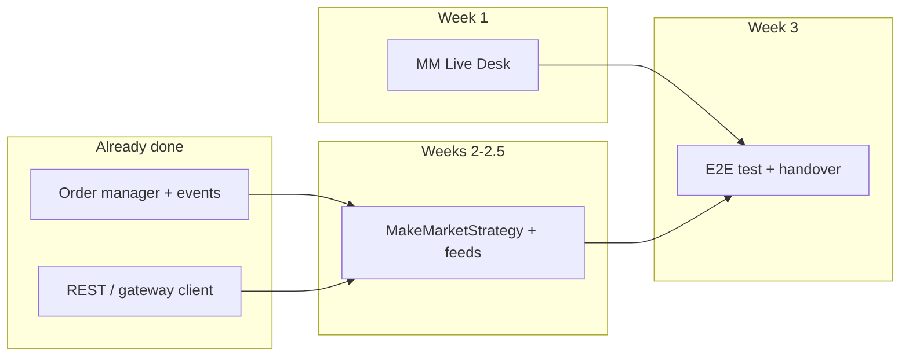

# Platform Core — MM Desk & C++ Strategy  
## AX project plan — three-week delivery (5 hours / working day)

**Prepared by:** Nilotpal Mrinal  
**Program / org:** Pallino — AX (Architect Exchange) market-making & operations desk  

**Assumption:** ~5 productive hours per day, ~5 working days per week unless noted.  
**Prerequisite (already delivered):** Basic order manager, REST/gateway wiring, core event flow, and related platform scaffolding.

**Total effort (this plan):** ~75 hours ≈ 15 person-days  
- GUI (MM Live Desk): **25 h** (1 week)  
- C++ market-maker & feeds: **37.5 h** (1.5 weeks)  
- End-to-end testing & handover: **12.5 h** (0.5 week)

---

## 1. Objectives

| Track | Goal |
|--------|------|
| **GUI** | Ship a usable MM Live Desk: depth, feeds, orders/fills, config controls, stable against real sandbox APIs. |
| **C++** | Production-grade make-market path: external theo, quoting logic, fill handling, latency/cancel correctness, config-driven churn. |
| **Integration** | Repeatable runbook, config templates, demo + handover so another engineer can operate and extend. |

---

## 2. Suggested calendar (anchored to C++ start **23 March**)

Adjust if your week-1 GUI dates differ; **relative ordering** is what matters.

| Calendar window | Phase | Focus |
|-----------------|--------|--------|
| **Mon 16 Mar – Fri 20 Mar** | Week 1 | GUI implementation & desk-level testing |
| **Mon 23 Mar – Fri 27 Mar** | Week 2 (part 1) | C++ strategy & feed integration |
| **Mon 30 Mar – Tue 31 Mar** | Week 2 (part 2) | C++ polish, edge cases, logging |
| **Wed 1 Apr (½ day)** | Buffer | Close remaining C++ items / doc touch-ups |
| **Wed 1 Apr (½) – Fri 3 Apr** | Week 3 (0.5 wk) | Full-stack test, handover pack |

*If you prefer a strict M–F block:* treat **1 Apr PM – 3 Apr** as the dedicated **test & handover** slice (2.5 days × 5 h).

---

## 3. Week 1 — GUI (MM Live Desk) — **25 h**

**Outcome:** Desk is demo-ready on sandbox; no critical blocking bugs on primary flows.

| Day | Hours | Themes |
|-----|-------|--------|
| **1** | 5 | Layout shell, connection status, config load/save paths, error surfacing |
| **2** | 5 | Architect depth/book: `/book`, `/ticker` fallbacks, symbol lists from `/instruments` |
| **3** | 5 | REST reference path: polled depth + metrics (mid/spread) |
| **4** | 5 | Activity: fills + orders history, pagination, field mapping (`o`, `txt`, `r`, `ts`, …) |
| **5** | 5 | Regression pass, timeouts/empty states, **desk-only** test notes; list known limitations |

**Exit criteria**

- [ ] Can run desk against sandbox with a configured AX symbol and matching external reference symbol without manual hacks.  
- [ ] Orders/fills views match gateway reality for a short scripted session.  
- [ ] Documented env vars / ports / one-page “how to run”.

---

## 4. Weeks 2–2.5 — C++ strategy & feeds — **37.5 h** *(from 23 Mar)*

**Outcome:** Strategy behaves predictably under load; config controls order churn; cancel/replace ordering is correct.

| Block | Hours | Themes |
|-------|-------|--------|
| **Days 1–2** | 10 | External feed → theo provider; MM timer vs feed callback; initial quote placement |
| **Days 3–4** | 10 | `requoteFromTheo`, inventory skew, `reload_on_fill`, accept/reject/fill handling |
| **Day 5** | 5 | Gateway integration: place/cancel/modify, exchange id vs internal id, sync vs async events |
| **Days 6–7** | 10 | Churn policy (`requote_on_theo_move`, `requote_on_timer`, `post_fill_extra_ticks`), latency instrumentation sanity |
| **Day 7.5** | 2.5 | Config defaults, `default_config.json` / examples, log noise review |

**Exit criteria**

- [ ] Wrong pricing scale (e.g. unrelated asset mid on the configured pair) is prevented or obvious in config/docs.  
- [ ] Fill-driven reload works; optional “quiet book” mode matches config.  
- [ ] `ORDER_CANCELLED` / critical path events ordered correctly vs HTTP (no stale oid cancels).  
- [ ] Short session log shows acceptable order count vs. fills for default churn settings.

---

## 5. Half week — Full infrastructure test & handover — **12.5 h**

| Day | Hours | Themes |
|-----|-------|--------|
| **1** | 5 | E2E script: start platform + desk, place/change width, observe depth & orders, restart recovery |
| **2** | 5 | Failure modes: bad symbol, API timeout, feed dropout; confirm behavior & logs |
| **3 (½)** | 2.5 | Handover: walkthrough, repo map, “how to change X”, backlog / nice-to-haves |

**Exit criteria**

- [ ] Single **Runbook** section (can live at end of this doc or `docs/RUNBOOK_MM.md`): prerequisites, start order, config keys table, troubleshooting.  
- [ ] Demo recording or screenshots optional but linked if available.  
- [ ] Open issues list with priority (P0/P1/P2).

---

## 6. Dependency graph (high level)

---

## 7. Risks & mitigations

| Risk | Mitigation |
|------|------------|
| Sandbox API shape drift | Pin doc links; desk tolerant parsers; log raw error bodies. |
| Clock / async ordering bugs | Prefer `publishSync` for cancel/modify paths; add trace ids in logs. |
| Scope creep on desk | Timebox “nice” panels; park P2 in backlog. |
| FX vs wrong instrument scale | Config review + comment in `default_config.json`; optional sanity assert on theo band. |

---

## 8. Handover checklist (quick)

- [ ] `config/default_config.json` + `config/config.example.json` aligned with runbook  
- [ ] List of **must-set** secrets (API keys) and **never commit** reminder  
- [ ] How to enable “aggressive refresh” vs “fill-driven” MM (`requote_on_*`)  
- [ ] Known issues + contact / repo pointer  
- [ ] Tag or commit hash considered “handover baseline”

---

## 9. Summary table

| Phase | Duration | Hours | Start (suggested) |
|-------|-----------|-------|-------------------|
| GUI | 1 week | 25 | ~16 Mar |
| C++ MM + feeds | 1.5 weeks | 37.5 | **23 Mar** |
| Test + handover | 0.5 week | 12.5 | ~1–3 Apr |
| **Total** | **3 weeks** | **~75** | — |

---

*Document version: 1.1 — AX project plan; author Nilotpal Mrinal (Pallino). Aligned with current `platform_core` MM desk + `MakeMarketStrategy` scope.*
